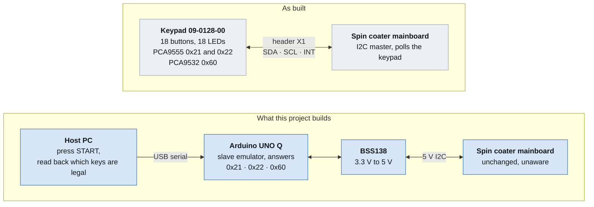
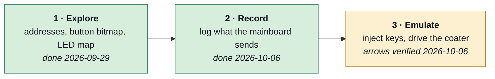
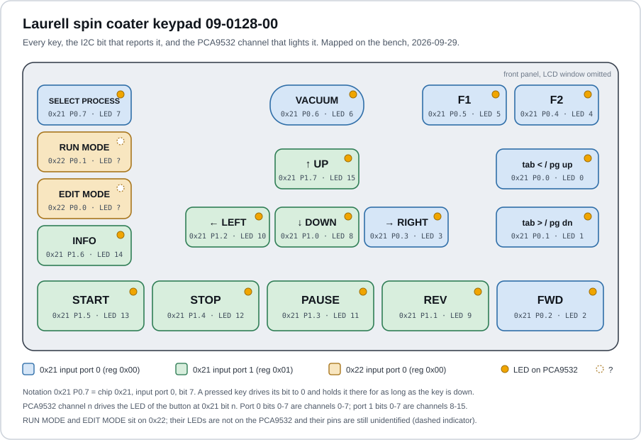
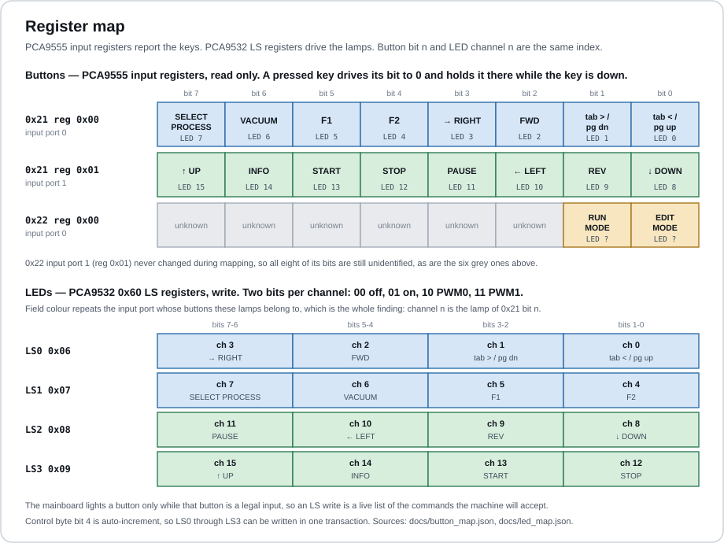
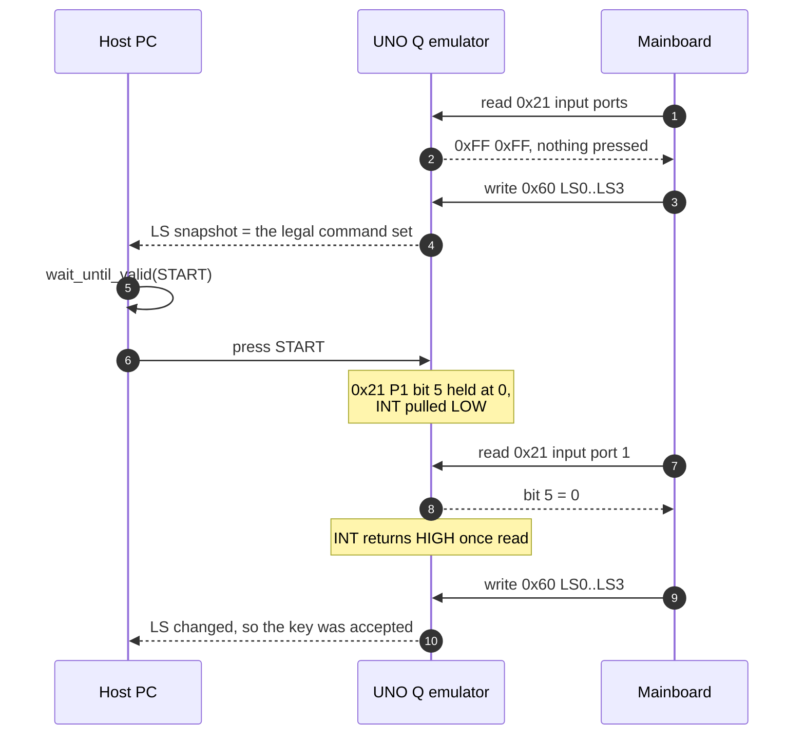
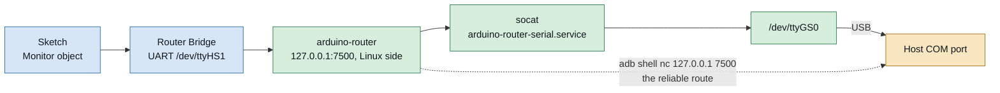
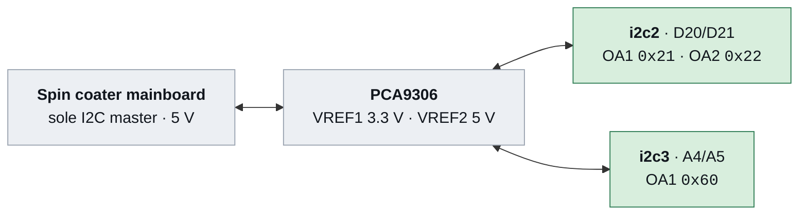
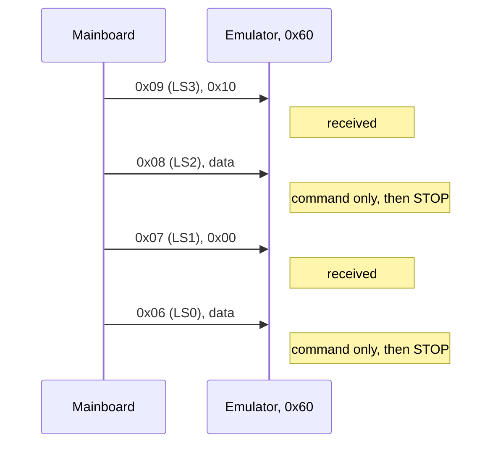
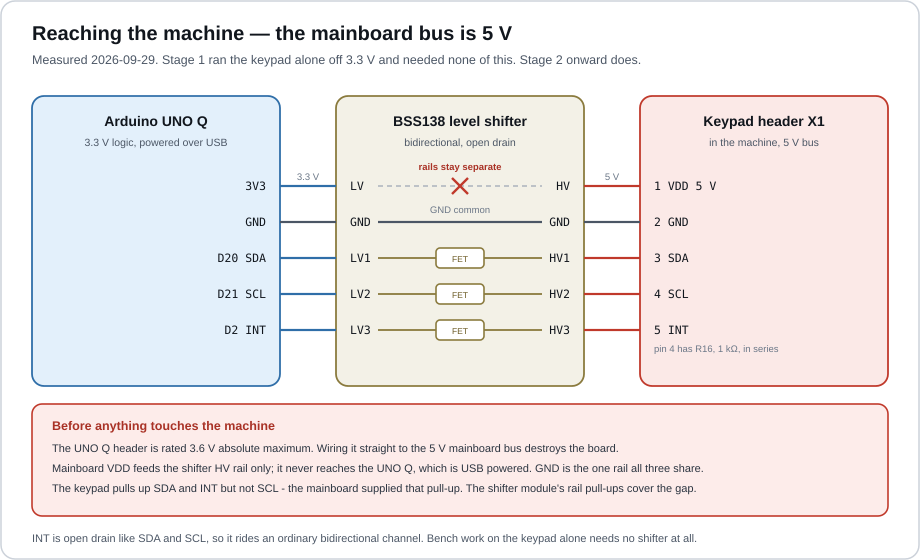
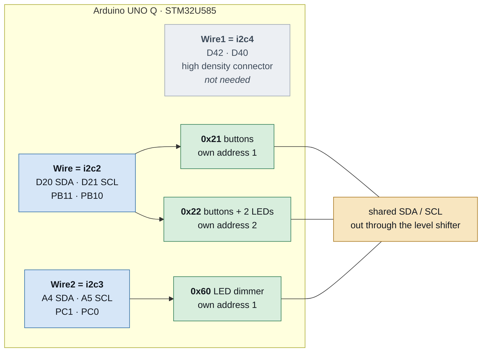

# SpinCoaterAutomation_I2C

Reverse-engineering the keypad board of a Laurell spin coater
(Ellenby Technologies 09-0128-00) over I2C, and then replacing that
keypad with an emulator so the machine can be driven from a host PC.
The specification is
[docs/spincoater_keypad_spec.md](docs/spincoater_keypad_spec.md).

The machine is not modified. Its mainboard keeps talking to what it
believes is the original keypad.



The keypad is the only part of the machine that has to be understood:
it is a plain I2C peripheral behind a five-pin header, so an emulator
that answers the same three addresses is indistinguishable from it.

## Status

All three stages have now been exercised on the real machine. The
emulator has replaced the keypad board and moved the menu cursor.



Stage 1 ran with the keypad board detached from the mainboard and
powered off the Arduino UNO Q's 3.3 V rail; all 18 buttons and all 16
PCA9532 LEDs were mapped there. For stages 2 and 3 the keypad was
unplugged for good and the UNO Q took its place on the mainboard bus
through a PCA9306 translator. The mainboard boots normally against the
emulator and the up and down arrows move the "Select Process" cursor.

Stage 3 is **partial**. `firmware/pca9555_emu` serves the two arrow
keys only and is fully verified. `firmware/pca9555_emu_gui` serves all
18 keys with a panel gated by the lamps; on the bench (2026-10-06) the
arrows, the lamp read-back and the timed key release work, but the
emulator loses some of the mainboard's transfers (see
[The fault](#the-fault-lost-transfers-after-an-even-command-byte-fixed)),
so the down arrow and tab/pg dn lamps stay dark and the eight keys on
`0x21` port 0 most likely do not reach the mainboard. The cause was
the targets' `TIMINGR` data-hold setting.
`firmware/pca9555_emu_gui_mk2` fixes it: on the bench (2026-10-06) its
lamps match the real keypad on Select Process and the port-0 key PGDN
turns the page. Nothing yet drives the chuck.

## Hardware

The keypad reaches the mainboard through one five-pin header, X1. The
LCD is a separate FPC straight to the mainboard and is out of scope.

| Position | Part | Role | I2C address |
| --- | --- | --- | --- |
| U4 | PCA9555D | 16 buttons | `0x21` |
| U6 | PCA9555D | 2 buttons, 2 LEDs (inferred) | `0x22` |
| U5 | PCA9532D | 16 LEDs | `0x60` |
| U1–U3 | MAX6818EAP | switch debouncers, about 40 ms | none |

### Header X1

| Pin | Signal | Evidence |
| --- | --- | --- |
| 1 | VDD | continuity |
| 2 | GND | continuity |
| 3 | SDA | continuity |
| 4 | SCL | R16, 1 kΩ, in series. Proven by a working 100 kHz bus |
| 5 | **INT** | measured, confirmed. Not RESET |

### Stage 1 bench wiring, keypad standalone

| UNO Q | Keypad X1 |
| --- | --- |
| 3.3V | VDD |
| GND | GND |
| D20 (SDA) | SDA |
| D21 (SCL) | SCL |
| D2 | INT |

> The UNO Q header's absolute maximum is 3.6 V. Never use the 5V pin.

## What the keypad turned out to be



A pressed key drives its bit to `0` and **holds it there for as long as
the key is down** — level, not edge. The full table is in
[docs/button_map.json](docs/button_map.json) and
[docs/led_map.json](docs/led_map.json); the panel photograph is
[docs/ButtonLayout.jpg](docs/ButtonLayout.jpg).



The single most useful finding is the index symmetry: **PCA9532 channel
n drives the LED of the button at `0x21` bit n**, with input port 0
bits 0–7 as channels 0–7 and input port 1 bits 0–7 as channels 8–15.
Button and lamp share one index, so no separate lookup table is needed.

There are 18 LEDs and the PCA9532 has 16 channels. Header X1 carries
only VDD, GND, SDA, SCL and INT, so every LED must be driven over I2C;
all 16 pins of `0x21` are buttons; therefore **the EDIT MODE and RUN
MODE lamps can only be on `0x22`.** Which pins exactly is a stage 2
question, answered by watching the mainboard write.

### The LEDs are a state feedback channel

This machine lights a button **only while that button is a legal input
in the current state**. So the LS register values the mainboard writes
to `0x60` are a live list of the commands it will currently accept. An
emulator that logs those writes hands the host a closed loop.



That is why `host/keypad_client.py` should be written around
`wait_until_valid(START)` followed by `press START`, rather than a blind
`press START`. It buys three things: no command is sent that would be
ignored, a key press can be confirmed by the change in the lit set, and
waiting becomes state-based instead of a fixed delay.

### INT

Exactly as the PCA9555 datasheet describes. INT goes LOW on any input
change and returns HIGH by itself once an input register is read.
Holding a key down keeps INT HIGH; only the next change pulls it low
again.

### Hardware faults found

- **The VACUUM dome switch makes poor contact.** Three deliberate
  presses produced one detection, and a 2 s press registered for only
  488 ms. The first mapping pass missed it entirely. This does not
  affect emulation, which never goes through the physical switch.
- **The right arrow bounces.** One 123 ms bounce was observed despite
  the MAX6818 debouncer.

## Development environment

### What you need

| Tool | Note |
| --- | --- |
| Arduino IDE | its bundled `arduino-cli` is the one used here |
| `arduino:zephyr` core 1.0.0 | installs `adb` 32.0.0 as well; no separate platform-tools |
| `Arduino_RouterBridge` library | without it the build fails on an `#error` |
| `gh` CLI | issue and PR management |

```sh
CLI="/c/Program Files/Arduino IDE/resources/app/lib/backend/resources/arduino-cli.exe"
"$CLI" core install arduino:zephyr@1.0.0
"$CLI" lib install Arduino_RouterBridge
```

### Serial on the UNO Q, which is not obvious

The MCU's `Serial` does not reach the host PC. The path is:



So a sketch must print to `Monitor`, **not** to `Serial`:

```c
#include <Arduino_RouterBridge.h>

void setup() {
    Serial.begin(115200);
    Bridge.begin();
    Monitor.begin(115200);
    while (!Monitor) { delay(500); }
    Monitor.println("hello");   // not Serial.println
}
```

`arduino-cli monitor -p COM17` on the host sometimes reads nothing. The
dependable route is to read the Linux-side socket over adb:

```sh
ADB="$LOCALAPPDATA/Arduino15/packages/arduino/tools/adb/32.0.0/adb.exe"
"$ADB" shell "nc 127.0.0.1 7500"
```

`setup()` output appears once, right after boot. Start the capture
first and re-upload to force a reset, or the initial register dump is
lost.

### Build and upload

```sh
"$CLI" compile --fqbn arduino:zephyr:unoq firmware/i2c_scan
"$CLI" upload  --fqbn arduino:zephyr:unoq -p COM17 firmware/i2c_scan
```

The port number differs per machine; `"$CLI" board list` reports it.
Upload works by the Linux side writing the STM32U585 over SWD, so no
bootloader button press is involved.

## Repository layout

```text
docs/
  spincoater_keypad_spec.md   the specification
  ButtonLayout.jpg            front panel photograph
  button_map.json             all 18 buttons
  led_map.json                16 mapped LEDs plus the inference for the other 2
  diagrams/                   SVG figures used by this README
firmware/
  i2c_scan/                   bus address scan
  pca9532_led/                LED control, including a walk mode for mapping
  pca9555_emu/                emulator, arrow keys only, with its Tk panel
  pca9555_emu_gui/            emulator, all 18 keys, with a lamp-gated panel
  pca9555_emu_gui_mk2/        the same, with the data-hold fix; nothing lost
claude_test/
  keypad_probe/               button mapping probe and its bench logs
  bus_check/                  reads SDA, SCL and INT levels without using Wire
  slave_selftest/             proves the UNO Q works as an I2C target
  dual_target/                proves one controller can hold two addresses
  menu_cursor_check/          camera harness and the first emulator runs
  lamp_trace/                 raw traces of the lost LS0/LS2 bytes
  key_release/                the timer-driven key release on the bench
  led_only/                   the bus served by one controller alone
```

### Firmware

| Sketch | Role | Status |
| --- | --- | --- |
| `i2c_scan` | bus address scan | verified on hardware |
| `pca9532_led` | LED control (`LED n on/off/pwm0/pwm1`, `ALL off`, `WALK ms`, `HALT`) | verified on hardware |
| `pca9555_poll` | button polling | not written; `claude_test/keypad_probe` covers it for now |
| `pca9555_emu` | slave emulator: answers `0x21`, `0x22` and `0x60` for the mainboard, logs its traffic, injects the arrow keys | verified on hardware 2026-10-06 |
| `pca9555_emu_gui` | the same emulator serving all 18 keys, with `LEDS`/`LED22` lamp lines, a timer-driven key release, and `TRACE`/`HUSH` bus diagnostics | **partly verified** 2026-10-06: arrows, lamp read-back, release timing. Port-0 keys and the LS0/LS2 lamps fail ([#18](https://github.com/coport-uni/SpinCoaterAutomation_I2C/issues/18)) |
| `pca9555_emu_gui_mk2` | `pca9555_emu_gui` with the targets' `SDADEL` set to 4 on both controllers, so no transfer is lost | **verified** 2026-10-06: lamps match the real keypad, `DOWN`, `UP` and `PGDN` on camera. Other keys not pressed ([#22](https://github.com/coport-uni/SpinCoaterAutomation_I2C/issues/22)) |

[firmware/pca9555_emu/](firmware/pca9555_emu/) holds the sketch and the
Tk panel that drives it, `keypad_gui.py`, with a README giving the run
order and how the two fit together. The Python beside the sketch is host
tooling, not firmware; it lives there because a panel is useless apart
from the sketch it talks to. `pyproject.toml` holds the Ruff settings
for it, at the same 80 columns the sketches use.

[firmware/pca9555_emu_gui/](firmware/pca9555_emu_gui/) is the full-panel
variant. Its panel lays the keys out as the real overlay and enables a
key only while its lamp is lit, with an "unlock all keys" switch for the
lamps the emulator cannot yet see.
[firmware/pca9555_emu_gui_mk2/](firmware/pca9555_emu_gui_mk2/) is the
same sketch with the data-hold fix, and the one to use: with it the
emulator sees every lamp.

`pca9532_led` refuses `ALL on` on purpose, to avoid lighting all 16
LEDs at once while the board is running off a 3.3 V bench supply.

`pca9555_emu` refuses every key except the two arrows, by name, in
`handle_line()`. START, STOP and VACUUM cannot be reached from the host
protocol at all — not because the host declines to ask, but because the
firmware will not serve the request. Its host commands are:

```
PRESS UP [ms]      hold the up arrow, default 100 ms, 20..1000
PRESS DOWN [ms]    hold the down arrow
RELEASE            release early
STATE              print the register files and the INT level
LOG ON | LOG OFF   log every read, not only the ones that changed
```

## The mainboard, measured 2026-10-06

With the keypad unplugged and `firmware/pca9555_emu` answering in its
place, the spin coater was powered on and its traffic recorded from the
first byte. This is the stage 2 data the specification asked for.



A4 and A5 are jumpered to D20 and D21, so both controllers sit on the
one physical bus. All three addresses registered with `rc=0`.

### What it writes at power-on

Six writes, and then it never writes again unless something changes:

| Order | Address | Register | Value | Meaning |
| --- | --- | --- | --- | --- |
| 1 | `0x60` | `0x03` PWM0 | `0x00` | dimmer duty |
| 2 | `0x22` | `0x03` output 1 | `0x00` | |
| 3 | `0x22` | `0x07` config 1 | `0x00` | **port 1 is all outputs** |
| 4 | `0x60` | `0x09` LS3 | `0x10` | channel 14 on |
| 5 | `0x60` | `0x07` LS1 | `0x00` | channels 4–7 off |
| 6 | `0x22` | `0x03` output 1 | `0xFC` | **bits 0 and 1 driven low** |

Write 3 answers an open item. The mainboard declares all of `0x22`
port 1 as outputs and then pulls bits 0 and 1 low, which is how the two
LEDs that are not on the PCA9532 are driven. The buttons EDIT MODE and
RUN MODE are on `0x22` port **0**; their indicator LEDs are on `0x22`
port **1**, bits 0 and 1, active low.

This table is what the emulator **received**, and it is incomplete. A
raw trace taken later the same day shows the mainboard writing all four
selectors, `LS3`, `LS2`, `LS1`, `LS0`, 1 to 2 ms apart; the transfers to
`LS2` (`0x08`) and `LS0` (`0x06`) reach the emulator as a command byte
and a STOP with no data. On the real keypad the same screen lights the
down arrow (channel 8, `LS2`) and tab/pg dn (channel 1, `LS0`), so the
mainboard does drive them. Earlier versions of this README said it
never wrote those two registers; that was the emulator's blind spot, not
the mainboard's behaviour.

### How it reads

Only `0x21` is read on a schedule. `0x22` and `0x60` were each read
once during start-up and never again. The raw trace shows each 50 ms
cycle as three transfers: command `0x00` to `0x21`, command `0x01` to
`0x21` followed by a one-byte read, and command `0x00` to `0x22`. The
reads that should follow the two `0x00` commands never reach the
emulator (see below). Each read is logged as two `TX` bytes; the second
is the driver prefetching, not a byte the mainboard takes.

| Measure | Value |
| --- | --- |
| Registers polled | `0x00` and `0x01` of `0x21`, as one pair |
| Rate | 40 register reads per second, steady |
| Period | **50 ms** per pair |
| Dropped log events over 150 s | 0 |

### INT is not required

The expanders' interrupt line has no channel left on a two-channel
PCA9306, so D2 was left unconnected and `INT_WIRED` is `0`. The 50 ms
poll is unconditional, so the mainboard sees a key purely from the input
register. A 120 ms hold is comfortably longer than one poll period and
was accepted every time.

Wiring INT straight across would be a fault, not a shortcut: the line is
pulled to 5 V on the mainboard side whenever it is released, and the
UNO Q's D2 does not tolerate that.

### The LED write confirms the cursor independently

Channel 15 is the up arrow's lamp. On row 1 it is dark, because there is
nowhere to go up; it lights as soon as the cursor leaves row 1.

| Cursor | `LS3` (`0x60` reg `0x09`) | Channel 14 | Channel 15 |
| --- | --- | --- | --- |
| row 1 | `0x10` | on | off |
| rows 2–4 | `0x50` | on | on |

So the mainboard's own LED traffic reports where the cursor is, without
the camera. That is the "list of keys you may press right now" channel
the operator noticed on the real keypad, read from the other side.

### The fault: lost transfers after an even command byte (fixed)

> **Fixed 2026-10-06** in `firmware/pca9555_emu_gui_mk2`
> ([#22](https://github.com/coport-uni/SpinCoaterAutomation_I2C/issues/22)):
> the STM32 targets' data-hold delay, `SDADEL`, set to 4 instead of the
> driver's 12. With it the lamps match the real keypad and the port-0
> keys reach the mainboard. The record of how it was found follows.

Measured 2026-10-06 with `TRACE ON` and `HUSH`, which record every
target callback while printing nothing
(`claude_test/lamp_trace/trace_hush.log`, `trace_diag.log`). The
selector writes on a screen change, as the emulator sees them:



Across every log so far the rule has no exception: **after an even
command byte the follow-up is lost, after an odd one it arrives.**

| Command byte | Follow-up | Result |
| --- | --- | --- |
| `0x21` `0x00`, `0x22` `0x00` | read | lost |
| `0x60` `0x08` (`LS2`), `0x06` (`LS0`) | data byte | lost |
| `0x21` `0x01`, `0x22` `0x01`, `0x60` `0x01` | read | arrives |
| `0x60` `0x03`, `0x07`, `0x09`; `0x22` `0x03`, `0x07` | data byte | arrives |

What has been ruled out:

- **The Zephyr driver.** The Arduino core ships Zephyr 4.4.2-rc1. Its
  STM32 v2 target path handles RXNE before STOP, so a byte the hardware
  received would still reach the callback. The missing bytes never got
  that far.
- **A bus error.** A target `error` callback was registered and never
  fired.
- **Monitor load.** The losses are the same with nothing printed.
- **The second controller.** `claude_test/led_only` served `0x21` and
  `0x60` from i2c2 alone, i2c3 unused and the A4/A5 jumpers pulled,
  and lost the same transfers (`run3_0x21_0x60.log`).
- **The LED map.** What did arrive lights one channel; no remapping
  turns one channel into the three lamps the real panel shows.

**Found, 2026-10-06 evening: the target's data-hold delay.** The STM32
drives its ACK `SDADEL` after SCL falls. The driver computes `TIMINGR`
for the devicetree's 400 kHz, `0x40FC1228`: `PRESC` 4 and `SDADEL` 12,
about 375 ns at 160 MHz. `claude_test/ack_timing` changed `SDADEL` at
run time against the mainboard's 50 ms poll, no key pressed, about 100
polls per setting:

| i2c2 `SDADEL` (`PRESC` 4, 31.25 ns a step) | `0x21` `[00]` reads delivered |
| --- | --- |
| 0 to 7 (0 to 219 ns) | 101/101 at every step |
| 8 | 69/100 |
| 9 | 101/101 |
| 10 | 14/101 |
| 11, 12 (default), 13 | 0/101 |
| 14, 15 | 101/101 |
| `PRESC` 15 with `SDADEL` 0 or 15 (0 or 1.5 µs) | 101/101 |

`0x22` followed the same pattern. So the fault is a narrow window
around 250 to 410 ns after SCL falls, and the default lands in it. It is
not plain lateness: 437 ns, 469 ns and 1.5 µs all work. Why that window
fails is not explained; a logic analyser would show it.

With `SDADEL` 4 on both controllers and the spin coater power-cycled,
nothing was lost in four minutes: `0x21` `[00]` 4823/4823, `0x22` `[00]`
4835/4835, and `LS2` and `LS0` each arrived with their data byte. The
lost transfer now takes the same 124 µs from command byte to STOP as a
good one, against 68 µs before, so the mainboard had been reading a
NACK. The cycle-counter timing also rules out a spurious STOP at bit 0,
which would have ended the transfer within a microsecond or two.

Side measurement: one byte, command to data, takes 300 µs, so the
mainboard clocks the bus at about 30 kHz, not 100 kHz.

The fix is in `firmware/pca9555_emu_gui_mk2` ([#22](https://github.com/coport-uni/SpinCoaterAutomation_I2C/issues/22)).
On the bench it applied `SDADEL` 4 once on each controller and kept it.
At power-on the mainboard wrote `LS2 = 0x01` and `LS0 = 0x04` with
their data bytes, and the lamps read `LEDS .*......*.....*.` and
`LED22 out=0xFC`: tab/pg dn, down arrow, INFO, EDIT MODE and RUN MODE,
exactly the five lit on the real keypad. `PGDN`, a port-0 key, turned
the Select Process list to programs 5 to 8. Logs and frames are in
`claude_test/mk2_bench/`.

Two side findings from the same runs:

- **`Wire2` must be started.** With the A4/A5 jumpers in and i2c3 never
  begun, its pins held the bus dead and the mainboard was heard by
  nobody.
- **A key hold must not depend on `loop()`.** A 120 ms `PRESS` was held
  2.7 s while the log was busy. `pca9555_emu_gui` now releases the key
  from a kernel timer; on the bench both arrows released at exactly
  120 ms while `loop()` ran 2.7 s late (`claude_test/key_release/`).

## Next steps

### ⚠️ The mainboard bus is 5 V — do not connect without a shifter

Measured 2026-09-29: **the mainboard I2C bus is 5 V.** The UNO Q header
is rated 3.6 V absolute maximum, so **a direct connection destroys the
board.** A BSS138-class level shifter is mandatory.



| Shifter | Connects to |
| --- | --- |
| LV | UNO Q 3.3V |
| HV | mainboard 5 V |
| GND | common to both |
| LV1 / HV1 | D20 SDA / X1 SDA |
| LV2 / HV2 | D21 SCL / X1 SCL |
| LV3 / HV3 | D2 INT / X1 INT |

INT is open drain like SDA and SCL, so it fits a bidirectional channel
unchanged. **Mainboard VDD does not go to the UNO Q** — the Arduino is
powered over USB.

The shifter module carries pull-ups on both rails, which incidentally
fixes a second problem. The keypad pulls up SDA and INT but **not SCL**;
in the original machine the mainboard supplied that pull-up. The reason
this never showed up on the UNO Q is that Zephyr's pinctrl biases the
I2C pins with pull-ups. On other cores it does show up.

Bench work on the keypad alone needs no shifter: drive the keypad from
the UNO Q's 3.3 V rail, which is how all of stage 1 was done.

### Choosing the emulator board

The specification proposed three parallel Nanos or an AVR TWAMR hack to
answer three addresses at once. **Neither is needed.** The UNO Q was
measured working as a slave. The evidence:

- `CONFIG_I2C_TARGET=y` — target mode is built in
- `Wire.begin(uint8_t address)` calls Zephyr's `i2c_target_register()`,
  and the `onReceive` / `onRequest` callbacks are implemented
- three I2C controllers are exposed: `i2cs = <&i2c2>, <&i2c4>, <&i2c3>`
  → `Wire`, `Wire1`, `Wire2`
- `i2c3` is on the headers as PC0 = A5, PC1 = A4

### Slave operation, measured 2026-09-29

`claude_test/slave_selftest` proves it with two jumpers, A4↔D20 and
A5↔D21. `Wire2` (i2c3) opens as a `0x21` target and `Wire` (i2c2)
drives the bus as master. **The keypad must be disconnected** for this
— it is also `0x21`.

```text
ADDR 0x21
SCAN 1
WRITE ack=1
READ got=0x5A want=0x5A ok=1
CB req=1 recv=1 last=0xA5
RESULT PASS
```

Address acknowledgement, write ACK, returning a requested byte, and
both callbacks all work. Log:
`claude_test/slave_selftest/unoq_slave_verify.log`.

### Two targets per controller, measured 2026-09-29

The STM32 I2C has two own-address registers, OA1 and OA2, and the
Zephyr driver carries `target_cfg` **and** `target2_cfg` in
`struct i2c_stm32_data`. The second sits behind `CONFIG_I2C_STM32_V2`,
which this build's `autoconf.h` sets to `1`.

Arduino's `Wire` holds one `i2c_target_config` per instance, so it
cannot offer a second address by itself. Bringing the controller up with
`Wire2.begin()` and then calling Zephyr's `i2c_target_register()`
**directly** on the same device does work; `<zephyr/drivers/i2c.h>` and
`DEVICE_DT_GET(DT_NODELABEL(i2c3))` compile from an `.ino` unchanged.

`claude_test/dual_target` reports:

```text
REGISTER2 rc=0
ADDR 0x21
ADDR 0x22
SCAN 2
READ1 got=0x5A want=0x5A ok=1
READ2 got=0xB7 want=0xB7 ok=1
CB1 req=1 recv=1
CB2 req=1 recv=1 last=0xA5
RESULT PASS
```

Both addresses return their own byte and both callback sets fire
independently. Logs:
`claude_test/dual_target/unoq_dual_target_verify.log` and
`unoq_dual_target_swap_verify.log`, the latter with the roles swapped so
that each of the two controllers is known to hold a pair.

### Controller allocation



Two controllers on the ordinary headers, two addresses each, is four,
and only three are needed. The high density connector stays untouched
and `0x60` is kept — which matters, because the LED writes are the
emulator's state feedback channel.

> Measured since, 2026-10-06: with the mainboard as master, both
> controllers serve their addresses and the mainboard boots and moves
> the cursor. They do lose every transfer that follows an even command
> byte, and so does a single controller on its own, so the arrangement
> above is not the cause. The cause was the targets' data-hold delay;
> see [The fault](#the-fault-lost-transfers-after-an-even-command-byte-fixed).

### Open items

| Item | Impact |
| --- | --- |
| Mainboard bus voltage | **measured: 5 V.** Level shifter mandatory |
| Three addresses at once from one UNO Q | **resolved.** Target mode and two targets per controller both measured; two header controllers reach four addresses |
| Mainboard polling order, period, init sequence | **measured 2026-10-06.** Six init writes, then `0x21` input registers every 50 ms and nothing else |
| Which `0x22` pins carry the two LEDs | **measured 2026-10-06.** Output port 1, bits 0 and 1, active low |
| Whether INT must be driven | **no.** The 50 ms poll is unconditional, so D2 stays unconnected |
| Minimum key hold time the mainboard accepts | 120 ms works every time; the floor has not been searched |
| Transfers lost after an even command byte | **fixed in `pca9555_emu_gui_mk2`, #18/#21/#22.** `SDADEL` 12 (the 400 kHz default) loses them; `SDADEL` 4 delivers all of them. Why the 250 to 410 ns window fails is not explained. `pca9555_emu_gui` keeps the fault |
| Keys beyond the two arrows | served by both panel sketches. With `pca9555_emu_gui_mk2` the port-0 key `PGDN` works; the other 15 keys, `EDIT` and `RUN` among them, have not been pressed |
| A physical connector for X1 | not sourced |

The button map is confirmed once. §7 of the specification asks for two
independent reproductions, so a verification pass is still outstanding
for the buttons. The up arrow's lamp, channel 15, now has a second and
independent confirmation: it tracks the Select Process cursor from the
mainboard's own LED writes, with no keypad involved.

## References

- [NXP PCA9555 datasheet](https://www.nxp.com/docs/en/data-sheet/PCA9555.pdf)
- [NXP PCA9532 datasheet](https://www.nxp.com/docs/en/data-sheet/PCA9532.pdf)
- [Arduino UNO Q power specifications](https://docs.arduino.cc/tutorials/uno-q/power-specification/)
- [coport-uni/CommonClaude](https://github.com/coport-uni/CommonClaude)
