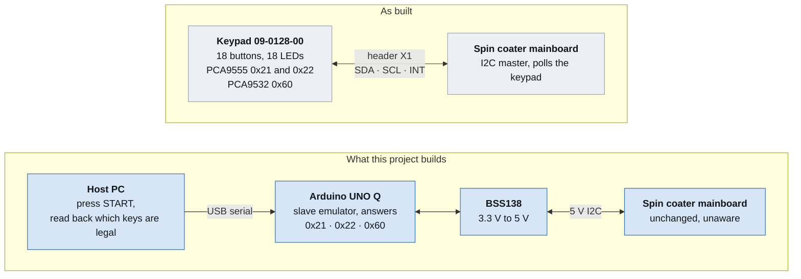
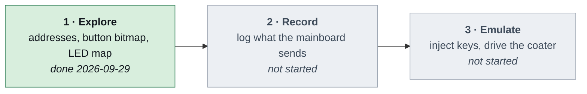
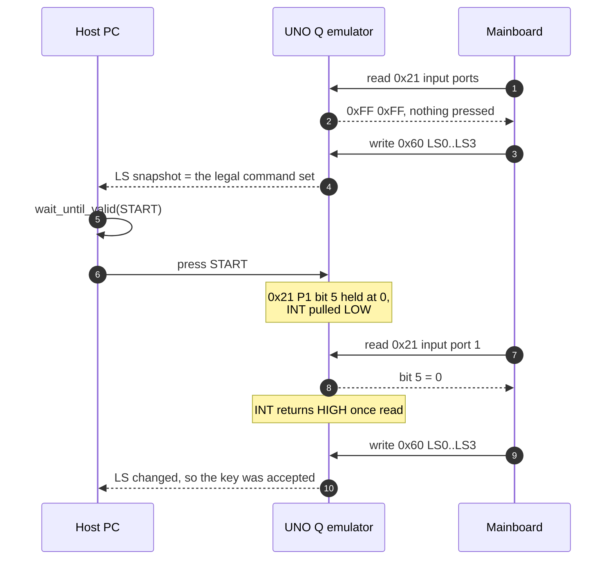
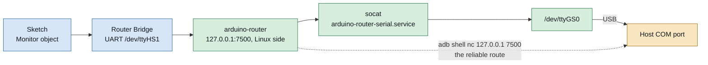
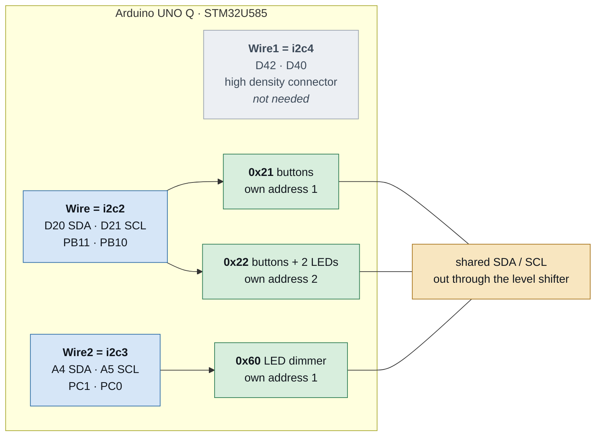

# SpinCoaterAutomation_I2C

Reverse-engineering the keypad board of a Laurell spin coater
(Ellenby Technologies 09-0128-00) over I2C, and then replacing that
keypad with an emulator so the machine can be driven from a host PC.
The specification is
[docs/spincoater_keypad_spec.md](docs/spincoater_keypad_spec.md).

The machine is not modified. Its mainboard keeps talking to what it
believes is the original keypad.



The keypad is the only part of the machine that has to be understood:
it is a plain I2C peripheral behind a five-pin header, so an emulator
that answers the same three addresses is indistinguishable from it.

## Status

Stage 1 of the three the specification defines is complete.



The keypad board was detached from the mainboard and run standalone off
the Arduino UNO Q's 3.3 V rail. All 18 buttons and all 16 PCA9532 LEDs
were mapped on that bench. **The mainboard has never been connected.**

## Hardware

The keypad reaches the mainboard through one five-pin header, X1. The
LCD is a separate FPC straight to the mainboard and is out of scope.

| Position | Part | Role | I2C address |
| --- | --- | --- | --- |
| U4 | PCA9555D | 16 buttons | `0x21` |
| U6 | PCA9555D | 2 buttons, 2 LEDs (inferred) | `0x22` |
| U5 | PCA9532D | 16 LEDs | `0x60` |
| U1–U3 | MAX6818EAP | switch debouncers, about 40 ms | none |

### Header X1

| Pin | Signal | Evidence |
| --- | --- | --- |
| 1 | VDD | continuity |
| 2 | GND | continuity |
| 3 | SDA | continuity |
| 4 | SCL | R16, 1 kΩ, in series. Proven by a working 100 kHz bus |
| 5 | **INT** | measured, confirmed. Not RESET |

### Stage 1 bench wiring, keypad standalone

| UNO Q | Keypad X1 |
| --- | --- |
| 3.3V | VDD |
| GND | GND |
| D20 (SDA) | SDA |
| D21 (SCL) | SCL |
| D2 | INT |

> The UNO Q header's absolute maximum is 3.6 V. Never use the 5V pin.

## What the keypad turned out to be


A pressed key drives its bit to `0` and **holds it there for as long as
the key is down** — level, not edge. The full table is in
[docs/button_map.json](docs/button_map.json) and
[docs/led_map.json](docs/led_map.json); the panel photograph is
[docs/ButtonLayout.jpg](docs/ButtonLayout.jpg).


The single most useful finding is the index symmetry: **PCA9532 channel
n drives the LED of the button at `0x21` bit n**, with input port 0
bits 0–7 as channels 0–7 and input port 1 bits 0–7 as channels 8–15.
Button and lamp share one index, so no separate lookup table is needed.

There are 18 LEDs and the PCA9532 has 16 channels. Header X1 carries
only VDD, GND, SDA, SCL and INT, so every LED must be driven over I2C;
all 16 pins of `0x21` are buttons; therefore **the EDIT MODE and RUN
MODE lamps can only be on `0x22`.** Which pins exactly is a stage 2
question, answered by watching the mainboard write.

### The LEDs are a state feedback channel

This machine lights a button **only while that button is a legal input
in the current state**. So the LS register values the mainboard writes
to `0x60` are a live list of the commands it will currently accept. An
emulator that logs those writes hands the host a closed loop.



That is why `host/keypad_client.py` should be written around
`wait_until_valid(START)` followed by `press START`, rather than a blind
`press START`. It buys three things: no command is sent that would be
ignored, a key press can be confirmed by the change in the lit set, and
waiting becomes state-based instead of a fixed delay.

### INT

Exactly as the PCA9555 datasheet describes. INT goes LOW on any input
change and returns HIGH by itself once an input register is read.
Holding a key down keeps INT HIGH; only the next change pulls it low
again.

### Hardware faults found

- **The VACUUM dome switch makes poor contact.** Three deliberate
  presses produced one detection, and a 2 s press registered for only
  488 ms. The first mapping pass missed it entirely. This does not
  affect emulation, which never goes through the physical switch.
- **The right arrow bounces.** One 123 ms bounce was observed despite
  the MAX6818 debouncer.

## Development environment

### What you need

| Tool | Note |
| --- | --- |
| Arduino IDE | its bundled `arduino-cli` is the one used here |
| `arduino:zephyr` core 1.0.0 | installs `adb` 32.0.0 as well; no separate platform-tools |
| `Arduino_RouterBridge` library | without it the build fails on an `#error` |
| `gh` CLI | issue and PR management |

```sh
CLI="/c/Program Files/Arduino IDE/resources/app/lib/backend/resources/arduino-cli.exe"
"$CLI" core install arduino:zephyr@1.0.0
"$CLI" lib install Arduino_RouterBridge
```

### Serial on the UNO Q, which is not obvious

The MCU's `Serial` does not reach the host PC. The path is:



So a sketch must print to `Monitor`, **not** to `Serial`:

```c
#include <Arduino_RouterBridge.h>

void setup() {
    Serial.begin(115200);
    Bridge.begin();
    Monitor.begin(115200);
    while (!Monitor) { delay(500); }
    Monitor.println("hello");   // not Serial.println
}
```

`arduino-cli monitor -p COM17` on the host sometimes reads nothing. The
dependable route is to read the Linux-side socket over adb:

```sh
ADB="$LOCALAPPDATA/Arduino15/packages/arduino/tools/adb/32.0.0/adb.exe"
"$ADB" shell "nc 127.0.0.1 7500"
```

`setup()` output appears once, right after boot. Start the capture
first and re-upload to force a reset, or the initial register dump is
lost.

### Build and upload

```sh
"$CLI" compile --fqbn arduino:zephyr:unoq firmware/i2c_scan
"$CLI" upload  --fqbn arduino:zephyr:unoq -p COM17 firmware/i2c_scan
```

The port number differs per machine; `"$CLI" board list` reports it.
Upload works by the Linux side writing the STM32U585 over SWD, so no
bootloader button press is involved.

## Repository layout

```text
docs/
  spincoater_keypad_spec.md   the specification
  ButtonLayout.jpg            front panel photograph
  button_map.json             all 18 buttons
  led_map.json                16 mapped LEDs plus the inference for the other 2
  diagrams/                   SVG figures used by this README
firmware/
  i2c_scan/                   bus address scan
  pca9532_led/                LED control, including a walk mode for mapping
claude_test/
  keypad_probe/               button mapping probe and its bench logs
  bus_check/                  reads SDA, SCL and INT levels without using Wire
  slave_selftest/             proves the UNO Q works as an I2C target
  dual_target/                proves one controller can hold two addresses
```

### Firmware

| Sketch | Role | Status |
| --- | --- | --- |
| `i2c_scan` | bus address scan | verified on hardware |
| `pca9532_led` | LED control (`LED n on/off/pwm0/pwm1`, `ALL off`, `WALK ms`, `HALT`) | verified on hardware |
| `pca9555_poll` | button polling | not written; `claude_test/keypad_probe` covers it for now |
| `pca9555_emu` | slave emulator | not written |

`pca9532_led` refuses `ALL on` on purpose, to avoid lighting all 16
LEDs at once while the board is running off a 3.3 V bench supply.

## Next steps

### ⚠️ The mainboard bus is 5 V — do not connect without a shifter

Measured 2026-09-29: **the mainboard I2C bus is 5 V.** The UNO Q header
is rated 3.6 V absolute maximum, so **a direct connection destroys the
board.** A BSS138-class level shifter is mandatory.


| Shifter | Connects to |
| --- | --- |
| LV | UNO Q 3.3V |
| HV | mainboard 5 V |
| GND | common to both |
| LV1 / HV1 | D20 SDA / X1 SDA |
| LV2 / HV2 | D21 SCL / X1 SCL |
| LV3 / HV3 | D2 INT / X1 INT |

INT is open drain like SDA and SCL, so it fits a bidirectional channel
unchanged. **Mainboard VDD does not go to the UNO Q** — the Arduino is
powered over USB.

The shifter module carries pull-ups on both rails, which incidentally
fixes a second problem. The keypad pulls up SDA and INT but **not SCL**;
in the original machine the mainboard supplied that pull-up. The reason
this never showed up on the UNO Q is that Zephyr's pinctrl biases the
I2C pins with pull-ups. On other cores it does show up.

Bench work on the keypad alone needs no shifter: drive the keypad from
the UNO Q's 3.3 V rail, which is how all of stage 1 was done.

### Choosing the emulator board

The specification proposed three parallel Nanos or an AVR TWAMR hack to
answer three addresses at once. **Neither is needed.** The UNO Q was
measured working as a slave. The evidence:

- `CONFIG_I2C_TARGET=y` — target mode is built in
- `Wire.begin(uint8_t address)` calls Zephyr's `i2c_target_register()`,
  and the `onReceive` / `onRequest` callbacks are implemented
- three I2C controllers are exposed: `i2cs = <&i2c2>, <&i2c4>, <&i2c3>`
  → `Wire`, `Wire1`, `Wire2`
- `i2c3` is on the headers as PC0 = A5, PC1 = A4

### Slave operation, measured 2026-09-29

`claude_test/slave_selftest` proves it with two jumpers, A4↔D20 and
A5↔D21. `Wire2` (i2c3) opens as a `0x21` target and `Wire` (i2c2)
drives the bus as master. **The keypad must be disconnected** for this
— it is also `0x21`.

```text
ADDR 0x21
SCAN 1
WRITE ack=1
READ got=0x5A want=0x5A ok=1
CB req=1 recv=1 last=0xA5
RESULT PASS
```

Address acknowledgement, write ACK, returning a requested byte, and
both callbacks all work. Log:
`claude_test/slave_selftest/unoq_slave_verify.log`.

### Two targets per controller, measured 2026-09-29

The STM32 I2C has two own-address registers, OA1 and OA2, and the
Zephyr driver carries `target_cfg` **and** `target2_cfg` in
`struct i2c_stm32_data`. The second sits behind `CONFIG_I2C_STM32_V2`,
which this build's `autoconf.h` sets to `1`.

Arduino's `Wire` holds one `i2c_target_config` per instance, so it
cannot offer a second address by itself. Bringing the controller up with
`Wire2.begin()` and then calling Zephyr's `i2c_target_register()`
**directly** on the same device does work; `<zephyr/drivers/i2c.h>` and
`DEVICE_DT_GET(DT_NODELABEL(i2c3))` compile from an `.ino` unchanged.

`claude_test/dual_target` reports:

```text
REGISTER2 rc=0
ADDR 0x21
ADDR 0x22
SCAN 2
READ1 got=0x5A want=0x5A ok=1
READ2 got=0xB7 want=0xB7 ok=1
CB1 req=1 recv=1
CB2 req=1 recv=1 last=0xA5
RESULT PASS
```

Both addresses return their own byte and both callback sets fire
independently. Logs:
`claude_test/dual_target/unoq_dual_target_verify.log` and
`unoq_dual_target_swap_verify.log`, the latter with the roles swapped so
that each of the two controllers is known to hold a pair.

### Controller allocation



Two controllers on the ordinary headers, two addresses each, is four,
and only three are needed. The high density connector stays untouched
and `0x60` is kept — which matters, because the LED writes are the
emulator's state feedback channel.

> Still unmeasured: the tests above had `Wire` acting as **master**. In
> the real emulator both controllers are targets and the mainboard is
> the master. Nothing suggests a problem, but that arrangement itself
> has not been run. A master does not acknowledge its own target
> address, so measuring it needs an external master — which means the
> level shifter and a second board.

### Open items

| Item | Impact |
| --- | --- |
| Mainboard bus voltage | **measured: 5 V.** Level shifter mandatory |
| Three addresses at once from one UNO Q | **resolved.** Target mode and two targets per controller both measured; two header controllers reach four addresses |
| Mainboard polling order, period, init sequence | this is what stage 2 is for |
| Minimum key hold time the mainboard accepts | to be searched from 100 ms in 50 ms steps |
| Which `0x22` pins carry the two LEDs | to be settled by the stage 2 log |
| A physical connector for X1 | not sourced |

The button map and the LED map are each confirmed once. §7 of the
specification asks for two independent reproductions, so a verification
pass is still outstanding.

## References

- [NXP PCA9555 datasheet](https://www.nxp.com/docs/en/data-sheet/PCA9555.pdf)
- [NXP PCA9532 datasheet](https://www.nxp.com/docs/en/data-sheet/PCA9532.pdf)
- [Arduino UNO Q power specifications](https://docs.arduino.cc/tutorials/uno-q/power-specification/)
- [coport-uni/CommonClaude](https://github.com/coport-uni/CommonClaude)
