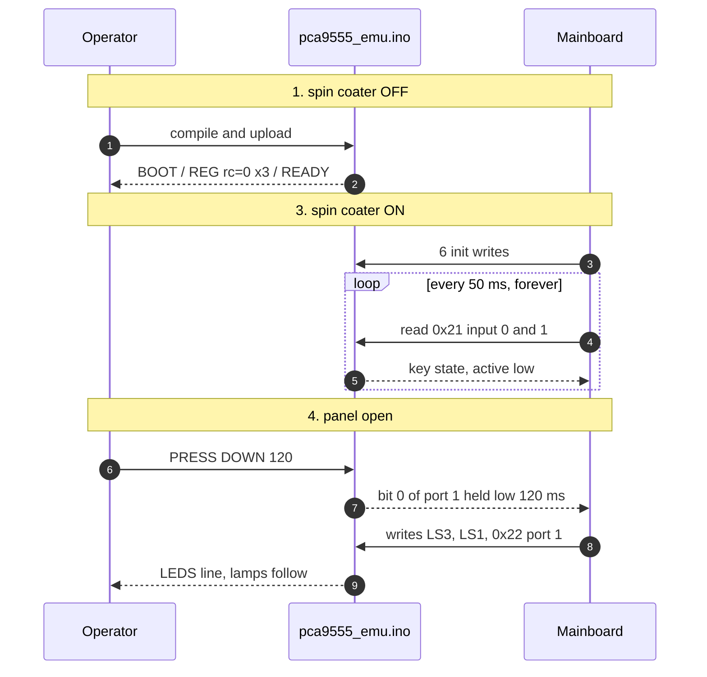
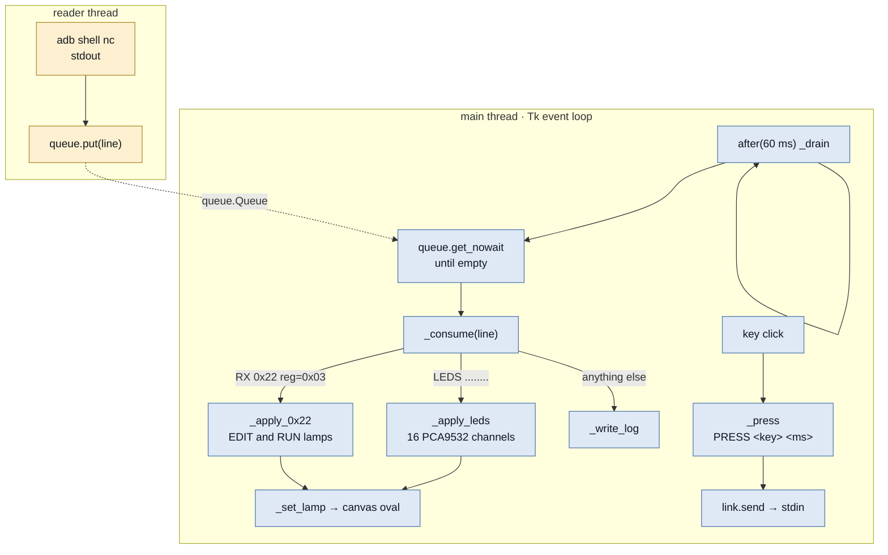

# pca9555_emu — keypad emulator and its panel

Two files that work as a pair:

| File | Runs on | Role |
| --- | --- | --- |
| `pca9555_emu.ino` | UNO Q (STM32U585) | answers the mainboard as the keypad's three I2C devices |
| `keypad_gui.py` | the PC | draws the panel, lights the lamps, sends key presses |

**Verified on the bench 2026-10-06**, operator present. This sketch
accepts only the up and down arrows; every other key name is refused in
`handle_line()`. For the whole panel see `../pca9555_emu_gui/`, which is
**not** verified yet.

## Where everything sits


The MCU's `Serial` never reaches the host. The Router Bridge puts it on
a socket on the board's own Linux side, and everything the GUI says or
hears goes through `adb shell nc 127.0.0.1 7500`.

## Running it, in order

Prerequisites: `arduino-cli` from the Arduino IDE, the `laurell` conda
environment, and the UNO Q on a USB port.

**1. Flash the sketch with the spin coater powered off.** What is
already on the MCU cannot be read back, and the previous sketch may
drive the bus as a master.

```sh
CLI="/c/Program Files/Arduino IDE/resources/app/lib/backend/resources/arduino-cli.exe"

"$CLI" compile --fqbn arduino:zephyr:unoq firmware/pca9555_emu
"$CLI" upload  --fqbn arduino:zephyr:unoq -p COM17 firmware/pca9555_emu
```

**2. Confirm the three addresses registered.** Start a reader before
power-on; `setup()` prints once and the output is gone if you miss it.

```sh
ADB="$LOCALAPPDATA/Arduino15/packages/arduino/tools/adb/32.0.0/adb.exe"
"$ADB" shell "nc 127.0.0.1 7500"
```

Expect, and do not continue without it:

```
BOOT pca9555_emu
REG addr=0x21 rc=0
REG addr=0x22 rc=0
REG addr=0x60 rc=0
READY
```

**3. Power the spin coater on** and watch the first 30 s. The LCD should
come up normally and no key should read as pressed.

**4. Open the panel.**

```sh
"$USERPROFILE/miniconda3/envs/laurell/python.exe" \
    firmware/pca9555_emu/keypad_gui.py
```

To take photographs of the LCD at each step instead, use the bench
harness in `claude_test/menu_cursor_check/` — see its README.



## How the GUI works

Tk is single threaded and a blocking read would freeze the window, so
the connection is read on its own thread and the two sides meet at a
queue. Every widget call happens on the main thread.



`_drain` reschedules itself every 60 ms, which is how a Tk program does
periodic work without a second event loop.

### The lamps

`led_pattern` matches the emulator's `LEDS` line, 16 characters, one per
PCA9532 channel: `.` off, `*` on, `0` and `1` the two blink rates.
`docs/led_map.json` says which channel belongs to which key.

The EDIT MODE and RUN MODE lamps are not on the PCA9532. The mainboard
drives them through `0x22` output port 1, bits 0 and 1, active low, so
`rx_0x22_pattern` picks those writes out of the log instead.

A lit lamp means the spin coater will accept that key. The converse does
not hold — see `../pca9555_emu_gui/README.md`.

## Host protocol

```
PRESS <key> [ms]   hold one key, default 100 ms, range 20..1000
RELEASE            release early
STATE              print the register files and the INT level
LOG ON | LOG OFF   log every read, not only the ones that changed
HELP               list the commands
```

This sketch accepts only `UP` and `DOWN`; anything else returns `ERR`.

## Safety

With the real keypad unplugged there is no physical STOP button. **The
mains switch is the stop for every run and belongs within reach.** Keep
the chuck empty and the lid closed unless a run requires otherwise, and
do not leave the panel open and unattended against a powered machine.
