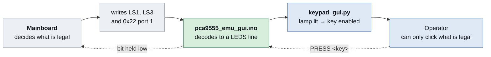

# pca9555_emu_gui — the whole panel, gated by the lamps

> **Run on the bench 2026-10-06**, operator present. What was actually
> exercised: the three addresses registering, the mainboard booting
> against it, `KEYS`, `HELP`, both rejection paths, and the two arrow
> keys moving the cursor on camera.
>
> **Not exercised: the other 16 keys.** `EDIT` and `RUN` matter most of
> those, because they are the only ones on expander `0x22` and so the
> only ones that use the second device in `press_dev`. The 14 remaining
> `0x21` keys share their whole code path with the arrows. Nothing that
> can turn the chuck has been pressed.

Same structure as its sibling, with two differences:

| | `../pca9555_emu/` | this folder |
| --- | --- | --- |
| Keys the sketch accepts | `UP` and `DOWN` only | all 18 |
| Keys the panel lets you click | `UP` and `DOWN` only | **whichever lamps are lit** |
| Verified | yes, 2026-10-06 | arrows and the command surface only |

## The idea

The mainboard lights a key's lamp while that key is a legal input in the
current machine state. So instead of a list of permitted keys written
into the GUI, the window follows the machine: a key is clickable exactly
while its lamp is lit. The spin coater decides, not this file.



This is **not** a safety interlock. The lid, the machine's own logic and
the mains switch are what stand between a key press and harm, exactly as
they did when the real keypad was plugged in.

## Why there is an "unlock all keys" switch

The gate is incomplete, and the switch exists because of it.

On the Select Process screen the mainboard writes only `LS1` and `LS3`
of the PCA9532 — never `LS0` or `LS2`. Channels 0–3 and 8–11 therefore
stay dark whatever the machine is doing, and **the down arrow is one of
them**, so a strictly lamp-gated panel cannot walk down a menu at all.

Measured from a cold boot, 2026-10-06:

| Cursor row | `LS3` | Lit on the PCA9532 |
| --- | --- | --- |
| 1 | `0x10` | channel 14, INFO |
| 2–4 | `0x50` | channels 14 and 15, INFO and up arrow |

Everything else the mainboard leaves at the power-on default, which the
[PCA9532 datasheet](https://www.nxp.com/docs/en/data-sheet/PCA9532.pdf)
gives as `00` per channel, output high-impedance, LED off.

Until it is known why those two registers are never written, the switch
turns the gate off and lets every key through. Leaving it on is the
honest default; ticking it is a deliberate act.

## Running it, in order

Identical to `../pca9555_emu/README.md`, with this folder's names:

```sh
CLI="/c/Program Files/Arduino IDE/resources/app/lib/backend/resources/arduino-cli.exe"

# 1. spin coater OFF
"$CLI" compile --fqbn arduino:zephyr:unoq firmware/pca9555_emu_gui
"$CLI" upload  --fqbn arduino:zephyr:unoq -p COM17 firmware/pca9555_emu_gui

# 2. watch for BOOT / REG rc=0 x3 / READY before going on
ADB="$LOCALAPPDATA/Arduino15/packages/arduino/tools/adb/32.0.0/adb.exe"
"$ADB" shell "nc 127.0.0.1 7500"

# 3. spin coater ON, confirm the LCD comes up and no key reads pressed

# 4. open the panel
"$USERPROFILE/miniconda3/envs/laurell/python.exe" \
    firmware/pca9555_emu_gui/keypad_gui.py
```

See `../pca9555_emu/README.md` for how the Tk side is put together; the
threading, the queue and the `after()` drain are the same here.

## Host protocol

```
PRESS <key> [ms]   hold one key, default 100 ms, range 20..1000
RELEASE            release early
KEYS               list every key name
STATE              print the register files and the INT level
LOG ON | LOG OFF   log every read, not only the ones that changed
HELP               list the commands
```

Key names: `PGUP PGDN FWD RIGHT F2 F1 VACUUM SELECT DOWN REV LEFT PAUSE
STOP START INFO UP EDIT RUN`.

## Before the first run

`START`, `FWD`, `REV` and `VACUUM` can set the chuck turning or pull
vacuum. With the real keypad unplugged there is no physical STOP button,
so **the mains switch is the stop and belongs within reach.** Chuck
empty, lid closed, operator at the bench.
