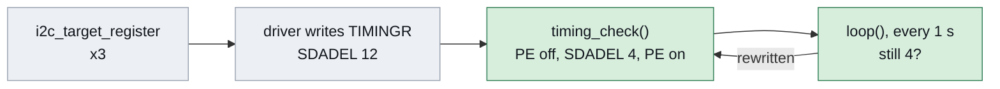

# pca9555_emu_gui_mk2 — the whole panel, without lost transfers

> **Run on the bench 2026-10-06**, operator present
> (`claude_test/mk2_bench/`). Exercised: `SDADEL` 4 applied once on
> each controller and kept; at power-on every lamp the real keypad
> shows on Select Process lit here too; `DOWN`, `UP` and the port-0 key
> `PGDN` moved the LCD on camera, each released at 120 ms.
>
> **Not exercised: the other 15 keys**, `EDIT` and `RUN` among them.
> Nothing that can turn the chuck has been pressed.

Mark 2 of [`../pca9555_emu_gui/`](../pca9555_emu_gui/README.md). The
keys, the lamp lines, the panel and the host protocol are the same. One
thing is different: the I2C targets' data-hold delay.

| | `../pca9555_emu_gui/` | this folder |
| --- | --- | --- |
| `SDADEL`, both controllers | 12, the driver's 400 kHz default, ~375 ns | **4, ~125 ns** |
| Follow-up after an even command byte | lost, every time (#18) | delivered |
| `LS0`/`LS2` lamps, port-0 key reads | never arrive | arrive; `PGDN` works |
| Verified | arrows, lamp lines, key release | lamps, `DOWN`, `UP`, `PGDN` |

## What was wrong, and the fix

The STM32 drives its ACK, and each bit it sends, `SDADEL` after SCL
falls. Zephyr computes `TIMINGR` from the devicetree's
`clock-frequency` of 400 kHz, `0x40FC1228`: `PRESC` 4, `SDADEL` 12. At
the 160 MHz kernel clock that puts the ACK about 375 ns after SCL falls.

`claude_test/ack_timing` changed `SDADEL` at run time against the
mainboard's 50 ms poll, about 100 polls a setting, no key pressed:

| `SDADEL` (31.25 ns a step) | `0x21` `[00]` reads delivered |
| --- | --- |
| 0 to 7 | 101/101 |
| 8 | 69/100 |
| 9 | 101/101 |
| 10 | 14/101 |
| 11, **12**, 13 | 0/101 |
| 14, 15 | 101/101 |

So there is a failing window around 250 to 410 ns, and the default sits
in it. Why that window fails is not known; the value is measured, not
derived. With `SDADEL` 4 on both controllers and the spin coater
power-cycled, nothing was lost in four minutes, and `LS2` and `LS0`
arrived with their data bytes. See
[#21](https://github.com/coport-uni/SpinCoaterAutomation_I2C/issues/21).



How the sketch applies it:

- **After all three registrations.** Each `i2c_target_register`
  recomputes `TIMINGR`, so an earlier write would be lost.
- **Only between transfers.** `TIMINGR` can be written only with the
  peripheral disabled (`PE` = 0). The sketch drops `PE` only while the
  bus reads idle, with interrupts locked, and sets it again at once.
  Own addresses and interrupt enables survive `PE` = 0.
- **Checked once a second.** If the value has been rewritten, it is
  applied again and a `TIMING` line is printed. The `applied=` counter
  shows how often; more than 1 means something rewrote it.
- **Not guessed.** `SDADEL` 4 is 125 ns only at `PRESC` 4. If the
  driver ever picks another `PRESC`, the sketch prints a `WARN` line
  and leaves the register alone.

## Output added to the sibling's

```
BOOT pca9555_emu_gui_mk2
TIMING i2c2 timingr=0x40F41228 presc=4 sdadel=4 applied=1
TIMING i2c3 timingr=0x40F41228 presc=4 sdadel=4 applied=1
```

`STATE` ends with the same two lines. Everything else, including the
`LEDS` and `LED22` lamp lines, `TRACE` and `HUSH`, is described in
[`../pca9555_emu_gui/README.md`](../pca9555_emu_gui/README.md).

## The lamp gate

The panel enables a key only while its lamp is lit. In the first
emulator that gate was incomplete, because `LS0` and `LS2` never
arrived and the down arrow stayed dark. With the fix it should be
complete. On the bench the lamps matched the real keypad on Select
Process (`claude_test/KakaoTalk_20261006_142258731.jpg`: EDIT MODE,
RUN MODE, INFO, down arrow and tab/pg dn):

```
LEDS .*......*.....*. psc0=0xFF pwm0=0x00 psc1=0xFF pwm1=0x80
LED22 out=0xFC cfg=0x00
```

After `PGDN` the list showed programs 5 to 8 and the lamps became
`**......*.....**`: tab/pg up and the up arrow joined, because the
cursor can now go back. Only one screen has been compared, so the
"unlock all keys" switch stays, off by default.

## Running it, in order

```sh
CLI="/c/Program Files/Arduino IDE/resources/app/lib/backend/resources/arduino-cli.exe"

# 1. spin coater OFF
"$CLI" compile --fqbn arduino:zephyr:unoq firmware/pca9555_emu_gui_mk2
"$CLI" upload  --fqbn arduino:zephyr:unoq -p COM17 firmware/pca9555_emu_gui_mk2

# 2. watch for BOOT / REG rc=0 x3 / TIMING sdadel=4 x2 / READY
ADB="$LOCALAPPDATA/Arduino15/packages/arduino/tools/adb/32.0.0/adb.exe"
"$ADB" shell "nc 127.0.0.1 7500"

# 3. spin coater ON, confirm the LCD comes up and no key reads pressed

# 4. open the panel
"$USERPROFILE/miniconda3/envs/laurell/python.exe" \
    firmware/pca9555_emu_gui_mk2/keypad_gui.py
```

The A4/A5 to D20/D21 jumpers stay in: both controllers serve the one
bus.

## Before the first run

`START`, `FWD`, `REV` and `VACUUM` can set the chuck turning or pull
vacuum. With the real keypad unplugged there is no physical STOP button,
so **the mains switch is the stop and belongs within reach.** Chuck
empty, lid closed, operator at the bench.
